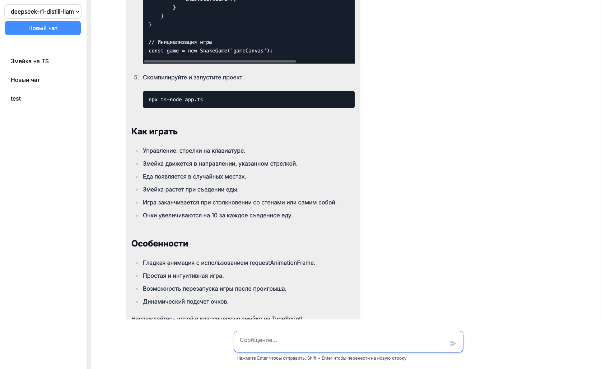

# Groq API Interface




Интерфейс для работы с API Groq, предоставляющим доступ к мощным AI-моделям. Проект разработан с использованием Vue 3, TypeScript и Tailwind CSS для создания современного и отзывчивого пользовательского интерфейса.

## 🚀 Особенности

- **Интеграция с Groq API**: Легкий и удобный доступ к AI-моделям через Groq API.
- **Современный стек технологий**: Использование Vue 3, TypeScript и Tailwind CSS.
- **Типизация и безопасность**: TypeScript обеспечивает строгую типизацию и уменьшает количество ошибок.
- **Кастомизация**: Легко настраиваемый интерфейс благодаря Tailwind CSS.

## 📦 Установка

1. Клонируйте репозиторий:
```bash
git clone https://github.com/nicrozj/llm-chat.git
```
2. Создайте .env в папке frontend и вставьте туда свой ключ из [Groq](https://console.groq.com/keys)
Пример:
```env
VITE_API_KEY=gsk_123456
```
4. Запустите проект
```bash
cd frontend
npm i
npm run dev
```
